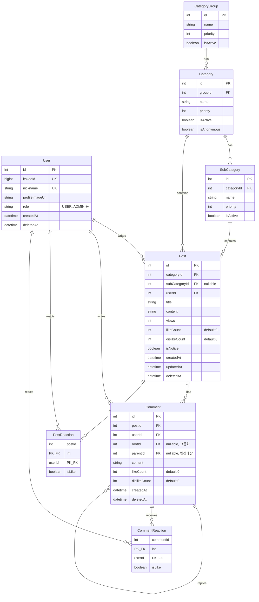

# 에대숲 v2 아키텍처 설계

> 마지막 업데이트: 2025-12-26

## 1. 개요

### 1.1 프로젝트 정보
- **서비스명**: 에대숲 (Czakuan)
- **서비스 유형**: 익명 커뮤니티 플랫폼
- **타겟 사용자**: 에버랜드 캐스트(직원) & 주변 상권 종사자

### 1.2 기술 스택
| 영역 | 기술 |
|------|------|
| **Frontend** | React + Vite |
| **Backend** | Hono |
| **Database** | PostgreSQL + Prisma |
| **Auth** | 카카오 OAuth + JWT |
| **State** | Zustand |
| **Routing** | React Router |
| **HTTP Client** | Axios |
| **Storage** | 추후 결정 (S3 호환) |
| **Mobile** | 추후 결정 (React Native) |

---

## 2. 데모 범위

### 2.1 포함 기능
- [x] 카카오 로그인
- [x] 게시글 CRUD
- [x] 댓글 + 대댓글
- [x] 익명 시스템 (해시 기반)
- [x] 좋아요/싫어요 (택1)
- [x] 카테고리 (3단계)

### 2.2 제외 기능 (추후 구현)
- [ ] 이미지 업로드
- [ ] 비공개 댓글
- [ ] 신고 기능
- [ ] 검색

---

## 3. 프로젝트 구조

### 3.1 모노레포 (pnpm workspace)

```
czakuan-v2/
├── apps/
│   ├── web/                     # React + Vite
│   │   ├── src/
│   │   │   ├── pages/           # 페이지 컴포넌트
│   │   │   ├── components/      # 공통 컴포넌트
│   │   │   ├── hooks/           # 커스텀 훅
│   │   │   ├── stores/          # Zustand 스토어
│   │   │   ├── api/             # API 클라이언트
│   │   │   ├── utils/           # 유틸리티
│   │   │   └── App.tsx
│   │   ├── index.html
│   │   ├── vite.config.ts
│   │   └── package.json
│   │
│   └── server/                  # Hono API 서버
│       ├── src/
│       │   ├── routes/          # API 라우트
│       │   ├── services/        # 비즈니스 로직
│       │   ├── repositories/    # DB 접근 계층
│       │   ├── middlewares/     # 미들웨어 (인증 등)
│       │   ├── utils/           # 유틸리티
│       │   └── index.ts
│       ├── prisma/
│       │   └── schema.prisma
│       └── package.json
│
├── packages/
│   └── shared/                  # 공통 타입, 유틸
│       ├── src/
│       │   ├── types/           # API 타입 정의
│       │   └── utils/           # 공통 유틸리티
│       └── package.json
│
├── package.json                 # 워크스페이스 루트
├── pnpm-workspace.yaml
└── README.md
```

### 3.2 패키지 매니저
- **pnpm** 사용
- 워크스페이스로 모노레포 관리

---

## 4. ERD



### 4.1 익명 처리
- **방식**: 해시 기반 (DB 저장 없음)
- **salt**: 환경변수 고정 값
- **계산**: `sha256(userId + postId + salt).substring(0, 6)`
- **표시**: 글쓴이 = "익명(글쓴이)", 댓글러 = "익명(a3f8e2)"

---

## 5. API 설계

> 상세 스펙: [API.md](./API.md)

### 5.1 스타일
- **RESTful** (언어/프레임워크 독립적)

### 5.2 HTTP 상태 코드 정책
| 상황 | 상태 코드 |
|------|----------|
| 비즈니스 로직 (성공/실패) | **200** |
| 인증 안 됨 | 401 |
| 서버 에러 | 500 |

### 5.3 응답 형식
```typescript
// 성공
{ success: true, data: T }

// 실패
{ success: false, error: { code: string, message: string } }
```

### 5.4 엔드포인트 요약
| 영역 | 개수 |
|------|------|
| 인증 (Auth) | 3개 |
| 사용자 (User) | 4개 |
| 카테고리 (Category) | 1개 |
| 게시글 (Post) | 7개 |
| 댓글 (Comment) | 5개 |
| **총** | **20개** |

---

## 6. 인증 플로우

### 6.1 OAuth 플로우
```
1. 웹에서 카카오 로그인 버튼 클릭
2. 카카오 OAuth 페이지로 리다이렉트
3. 인증 후 콜백 URL로 인가 코드(code) 전달
4. BE에 인가 코드 전달 (POST /auth/kakao)
5. BE에서 카카오 API로 토큰 교환 및 사용자 정보 조회
6. JWT 발급 (access + refresh)
7. 웹에서 localStorage에 저장
```

### 6.2 토큰 설정
| 토큰 | 만료 시간 |
|------|----------|
| Access Token | 1시간 |
| Refresh Token | 14일 |

### 6.3 토큰 갱신
- **방식**: 401 응답 시 자동 갱신
- **구현**: Axios interceptor에서 처리

```typescript
// API interceptor
api.interceptors.response.use(
  (response) => response,
  async (error) => {
    if (error.response?.status === 401) {
      const newToken = await refreshToken();
      if (newToken) {
        error.config.headers.Authorization = `Bearer ${newToken}`;
        return api.request(error.config);
      }
      // refresh 실패 시 로그아웃 처리
      logout();
    }
    return Promise.reject(error);
  }
);
```

### 6.4 토큰 저장 (Web)
```typescript
// 저장
localStorage.setItem('accessToken', accessToken);
localStorage.setItem('refreshToken', refreshToken);

// 조회
const accessToken = localStorage.getItem('accessToken');

// 삭제 (로그아웃)
localStorage.removeItem('accessToken');
localStorage.removeItem('refreshToken');
```

### 6.5 카카오 OAuth 설정
```
# 카카오 개발자 콘솔에서 설정
Redirect URI: {FRONTEND_URL}/auth/kakao/callback
```

---

## 7. 타입 공유

### 7.1 공유 패키지 구조
```
packages/shared/
├── src/
│   ├── types/
│   │   ├── api.ts          # API 응답 타입
│   │   ├── user.ts         # 사용자 관련 타입
│   │   ├── post.ts         # 게시글 관련 타입
│   │   ├── comment.ts      # 댓글 관련 타입
│   │   ├── category.ts     # 카테고리 관련 타입
│   │   └── index.ts        # 타입 export
│   └── utils/
│       └── index.ts        # 공통 유틸리티
├── package.json
└── tsconfig.json
```

### 7.2 사용 방법
```typescript
// apps/web 또는 apps/server에서
import { Post, ApiResponse, User } from '@czakuan/shared';
```

### 7.3 패키지 설정
```json
// packages/shared/package.json
{
  "name": "@czakuan/shared",
  "version": "0.0.1",
  "main": "./src/index.ts",
  "types": "./src/index.ts"
}
```

---

## 8. 배포

> 추후 결정

