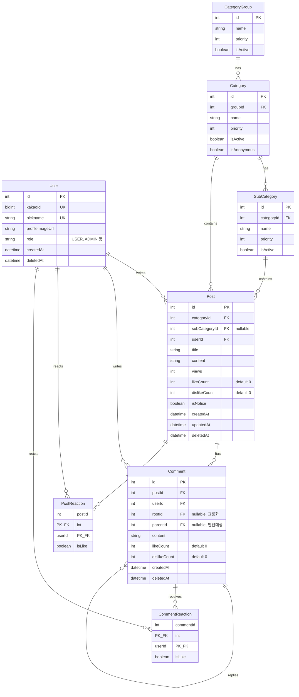

# 에대숲 v2 아키텍처 설계

> 마지막 업데이트: 2025-12-26

## 1. 개요

### 1.1 프로젝트 정보
- **서비스명**: 에대숲 (Czakuan)
- **서비스 유형**: 익명 커뮤니티 플랫폼
- **타겟 사용자**: 에버랜드 캐스트(직원) & 주변 상권 종사자

### 1.2 기술 스택
| 영역 | 기술 |
|------|------|
| **Mobile** | Expo (React Native) |
| **Backend** | Hono |
| **Database** | PostgreSQL + Prisma |
| **Auth** | 카카오 OAuth + JWT |
| **Storage** | 추후 결정 (S3 호환) |

---

## 2. 데모 범위

### 2.1 포함 기능
- [x] 카카오 로그인
- [x] 게시글 CRUD
- [x] 댓글 + 대댓글
- [x] 익명 시스템 (해시 기반)
- [x] 좋아요/싫어요 (택1)
- [x] 카테고리 (3단계)

### 2.2 제외 기능 (추후 구현)
- [ ] 이미지 업로드
- [ ] 비공개 댓글
- [ ] 신고 기능
- [ ] 검색

---

## 3. 프로젝트 구조

> TODO: 모노레포 구조 확정 필요

```
czakuan-v2/
├── apps/
│   ├── mobile/          # Expo 앱
│   └── server/          # Hono API 서버
├── packages/
│   └── shared/          # 공통 타입, 유틸
├── package.json         # 워크스페이스 루트
└── pnpm-workspace.yaml
```

---

## 4. ERD



### 4.1 익명 처리
- **방식**: 해시 기반 (DB 저장 없음)
- **salt**: 환경변수 고정 값
- **계산**: `sha256(userId + postId + salt).substring(0, 6)`
- **표시**: 글쓴이 = "익명(글쓴이)", 댓글러 = "익명(a3f8e2)"

---

## 5. API 설계

> 상세 스펙: [API.md](./API.md)

### 5.1 스타일
- **RESTful** (언어/프레임워크 독립적)

### 5.2 HTTP 상태 코드 정책
| 상황 | 상태 코드 |
|------|----------|
| 비즈니스 로직 (성공/실패) | **200** |
| 인증 안 됨 | 401 |
| 서버 에러 | 500 |

### 5.3 응답 형식
```typescript
// 성공
{ success: true, data: T }

// 실패
{ success: false, error: { code: string, message: string } }
```

### 5.4 엔드포인트 요약
| 영역 | 개수 |
|------|------|
| 인증 (Auth) | 3개 |
| 사용자 (User) | 4개 |
| 카테고리 (Category) | 1개 |
| 게시글 (Post) | 7개 |
| 댓글 (Comment) | 5개 |
| **총** | **20개** |

---

## 6. 인증 플로우

### 6.1 OAuth 플로우
```
1. Expo에서 카카오 로그인 (expo-auth-session)
2. 카카오 access token 획득
3. BE에 카카오 토큰 전달 (POST /auth/kakao)
4. BE에서 카카오 API로 사용자 정보 조회
5. JWT 발급 (access + refresh)
6. Expo에서 SecureStore에 저장
```

### 6.2 토큰 설정
| 토큰 | 만료 시간 |
|------|----------|
| Access Token | 1시간 |
| Refresh Token | 14일 |

### 6.3 토큰 갱신
- **방식**: 401 응답 시 자동 갱신
- **구현**: API interceptor에서 처리

```typescript
// Expo API client
api.interceptors.response.use(
  (response) => response,
  async (error) => {
    if (error.response?.status === 401) {
      const newToken = await refreshToken();
      if (newToken) {
        error.config.headers.Authorization = `Bearer ${newToken}`;
        return api.request(error.config);
      }
    }
    return Promise.reject(error);
  }
);
```

### 6.4 토큰 저장 (Expo)
```typescript
import * as SecureStore from 'expo-secure-store';

// 저장
await SecureStore.setItemAsync('accessToken', accessToken);
await SecureStore.setItemAsync('refreshToken', refreshToken);

// 조회
const accessToken = await SecureStore.getItemAsync('accessToken');
```

---

## 7. 타입 공유

> TODO: 확정 필요

---

## 8. 배포

> 추후 결정

